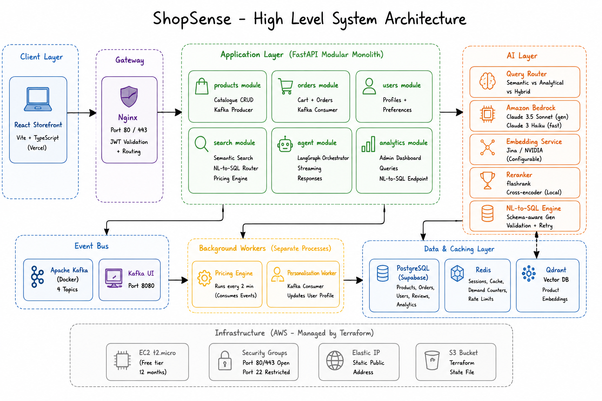
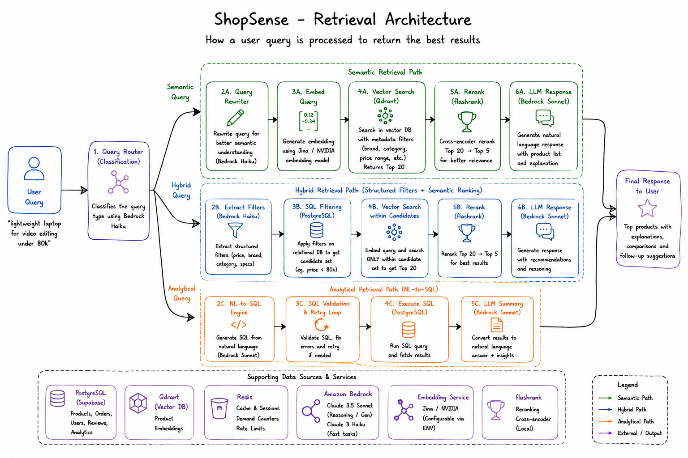
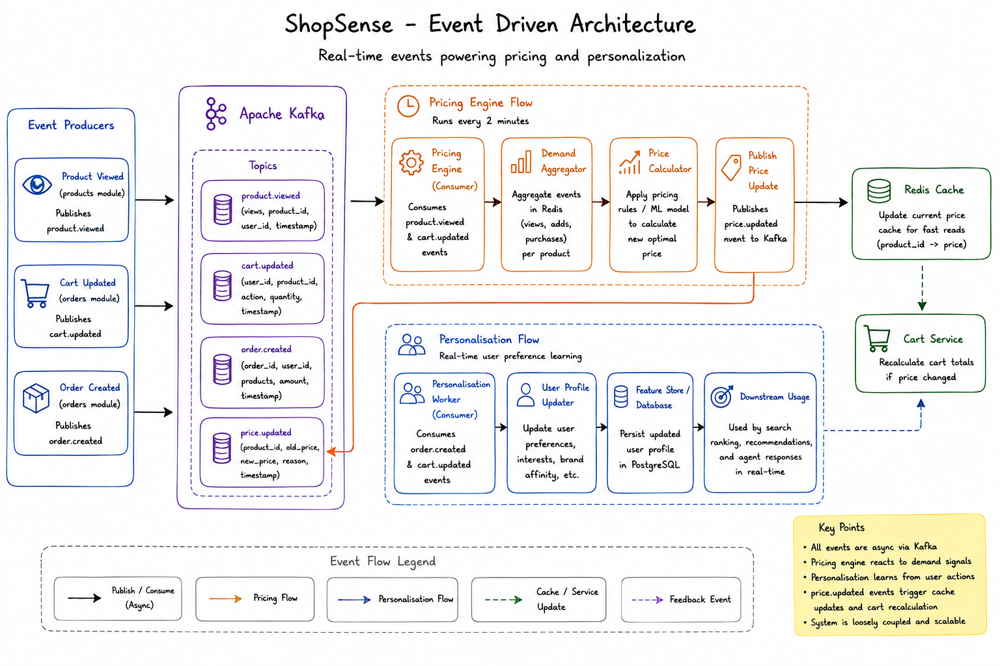

# ShopSense — AI-Native Product Discovery Platform

> A production-grade e-commerce search and discovery platform that replaces keyword search with semantic understanding, adds a conversational AI agent, and uses real-time demand signals to adjust prices dynamically.

**Built by Rohit Hebbar · May 2026 · Active Development**

---

## What is ShopSense?

ShopSense is what Amazon Rufus looks like built from scratch — an AI-native product discovery platform for consumer electronics. A customer types *"laptop for video editing under ₹80K that is light for travel"* and receives a personalised, reasoned comparison — not a list of keyword matches.

| Problem | Before ShopSense | After ShopSense |
|---|---|---|
| Keyword mismatch | "laptop for video editing" → 0 results | Semantic search understands intent |
| No structured analytics | Admin cannot query data in plain English | NL-to-SQL answers "which brand has the highest rating?" |
| No reasoning | Star ratings hide what's actually wrong | Aspect-based sentiment extracts feature signals from reviews |
| No personalisation | Same results for every user | Kafka event stream builds real-time preference profiles |
| Static pricing | Price set once, never adjusts | Dynamic pricing engine reads demand signals every 2 minutes |

---

## Architecture

### High-Level System



A **modular monolith** — one FastAPI app, one EC2 instance, one `terraform apply`. Modules have clean boundaries (`products/`, `orders/`, `search/`, `agent/`, `analytics/`) but share the same process, database, and deployment unit. This is a deliberate choice: microservices add two weeks of infrastructure overhead with zero user-facing benefit at this scale.

### Retrieval Architecture



Every query is classified before retrieval:

- **SEMANTIC** → Jina v3 embeddings → Qdrant vector search → flashrank reranker
- **ANALYTICAL** → Bedrock Claude Haiku → schema-aware SQL → PostgreSQL
- **HYBRID** → SQL constrains the candidate set, vector search ranks within it

The query router (Bedrock Haiku, ~150ms) makes this decision. This is the correct architecture — vector search alone cannot answer "which brand has the highest average rating?", and SQL alone cannot capture "laptop that feels premium".

### Event-Driven Architecture



Five Kafka topics wire the system together:

| Topic | Producer | Consumers |
|---|---|---|
| `product.viewed` | products module | search module (Redis demand counter), personalisation worker |
| `product.created` | products module | embedding worker |
| `cart.updated` | orders module | personalisation worker |
| `order.created` | orders module | personalisation worker (highest weight signal) |
| `price.updated` | pricing engine | orders module (recalculates active cart totals) |

---

## Tech Stack

| Layer | Technology | Why |
|---|---|---|
| **API** | FastAPI + Python 3.11 | Async, typed, fast |
| **LLM** | Amazon Bedrock (Claude Sonnet 4.5 / Haiku 4.5) | No API key management, eu-north-1 inference profiles |
| **Embeddings** | Jina v3 (`jina-embeddings-v3`) | 1024-dim, task-aware query/passage modes, best retrieval quality |
| **Vector DB** | Qdrant Cloud | Cosine similarity, metadata payload filtering |
| **Database** | PostgreSQL (Supabase) | Products, orders, users, reviews, price history |
| **Cache** | Redis | Cart state (7d TTL), price cache (10min), demand counters |
| **Event Bus** | Apache Kafka (Docker) | Decoupled demand signals, price recalculation |
| **ORM** | SQLAlchemy 2.0 async | Mapped columns, selectinload |
| **Auth** | JWT (HS256) + bcrypt | Stateless, role-aware (customer / admin) |
| **Reranker** | flashrank | Local cross-encoder, no API cost |
| **Agent** | LangGraph | Stateful multi-node workflow, streaming |
| **Infra** | Terraform + AWS EC2 | Reproducible, free-tier deployable |
| **Observability** | LangSmith | Full agent trace per conversation |

---

## Data Pipeline

**21,173 real laptop products** sourced from Amazon product metadata + Kaggle datasets, deduplicated by name, and enriched with:

- **129,765 reviews** — streamed from McAuley Lab Amazon Reviews 2023 dataset (2M rows) + synthetic fill via Faker
- **1,503 products sentiment-scored** — Bedrock Haiku extracts 7 aspect sentiment scores (`battery`, `display`, `build_quality`, `value`, `performance`, `keyboard`, `thermal`) + `top_complaint` + `top_praise` per product
- **1,503 products embedded** — Jina v3 1024-dim vectors upserted to Qdrant Cloud with full metadata payload

```
data/ingestion/
├── process_amazon_products.py   # Streams and upserts Amazon metadata
├── process_kaggle_laptops.py    # Kaggle laptop dataset ingestion
├── fetch_amazon_reviews.py      # Streams 2M reviews, fuzzy-matches to products
├── sync_local_from_supabase.py  # UUID alignment between local and Supabase
├── run_sentiment.py             # Bedrock Haiku batch sentiment extraction
├── generate_embeddings.py       # Jina v3 embeddings → Qdrant Cloud
├── smoke_test_embeddings.py     # 3-way embedding provider comparison
└── verify_ingestion.py          # 10-query semantic quality gate
```

---

## Project Structure

```
shopsense/
├── app/
│   ├── main.py                  # FastAPI factory, lifespan events
│   ├── config.py                # Pydantic settings (single source of truth)
│   ├── database.py              # SQLAlchemy async engine
│   ├── redis_client.py          # Shared connection pool
│   ├── auth/                    # JWT auth, bcrypt, get_current_user, require_admin
│   ├── products/                # Catalogue CRUD, Kafka producer
│   ├── orders/                  # Cart (Redis), orders (PostgreSQL), Kafka consumer
│   ├── users/                   # UserPreferences — written by worker, read by agent
│   ├── search/                  # Embedder, Qdrant ops, query router, NL-to-SQL, pricing
│   ├── agent/                   # LangGraph graph, all nodes, streaming /chat SSE
│   ├── analytics/               # Admin NL-to-SQL BI endpoints
│   ├── schemas/                 # Shared Pydantic schemas for all LLM boundaries
│   └── mcp/                     # MCP server (port 8006), checkout tool
├── workers/
│   ├── pricing_engine.py        # 120s cycle, demand signals → price adjustments
│   └── personalisation.py       # Kafka consumer → UserPreferences updates
├── data/ingestion/              # One-time data pipeline scripts
├── database/migrations/         # Raw SQL migrations (numbered)
├── supabase/migrations/         # Supabase CLI migrations
├── tests/                       # pytest, module-per-module
├── terraform/                   # EC2, security groups, Elastic IP, S3 state
├── assets/                      # Architecture diagrams
├── docker-compose.yml           # Kafka, Redis, PostgreSQL, Kafka UI, Qdrant
└── pyproject.toml               # uv-managed dependencies
```

---

## Getting Started

### Prerequisites

- Python 3.11+
- Docker + Docker Compose
- [`uv`](https://github.com/astral-sh/uv) — `pip install uv`
- AWS account with Bedrock access (eu-north-1)
- Jina API key — [jina.ai](https://jina.ai) (free tier, no credit card)
- Supabase project — [supabase.com](https://supabase.com) (free tier)
- Qdrant Cloud cluster — [cloud.qdrant.io](https://cloud.qdrant.io) (free tier)

### 1. Clone and install

```bash
git clone https://github.com/your-username/shopsense.git
cd shopsense
make install          # uv sync --extra dev
```

### 2. Configure environment

```bash
cp .env.example .env
# Fill in: DATABASE_URL, JINA_API_KEY, AWS_REGION, QDRANT_URL, QDRANT_API_KEY
```

Key variables:

```env
DATABASE_URL=postgresql+asyncpg://...       # Supabase connection string
MIRROR_DATABASE_URL=postgresql+asyncpg://... # Local Docker postgres (ingestion only)
JINA_API_KEY=jina_...
AWS_REGION=eu-north-1
BEDROCK_GENERATION_MODEL_ID=eu.anthropic.claude-sonnet-4-5-20250929-v1:0
BEDROCK_FAST_MODEL_ID=eu.anthropic.claude-haiku-4-5-20251001-v1:0
QDRANT_URL=https://...cloud.qdrant.io
QDRANT_API_KEY=...
APP_SECRET_KEY=...    # openssl rand -hex 32
```

### 3. Start infrastructure

```bash
make dev
# Starts: PostgreSQL, Redis, Kafka, Kafka UI (localhost:8080), Qdrant
```

### 4. Run migrations

```bash
# Apply to Supabase via the SQL editor, or:
supabase db push
```

### 5. Run the data pipeline

```bash
make ingest
# Or individually:
uv run python data/ingestion/process_amazon_products.py
uv run python data/ingestion/fetch_amazon_reviews.py
uv run python data/ingestion/run_sentiment.py --limit 1500
uv run python data/ingestion/generate_embeddings.py
uv run python data/ingestion/verify_ingestion.py   # quality gate
```

### 6. Start the API

```bash
make dev
# API: http://localhost:8000
# Docs: http://localhost:8000/docs
# Kafka UI: http://localhost:8080
```

---

## API Overview

### Auth
```
POST /auth/register          # Create account
POST /auth/login             # Returns JWT
GET  /auth/me                # Current user
```

### Products
```
GET  /api/products           # Paginated list with filters
GET  /api/products/{id}      # Detail + reviews + fires product.viewed
POST /api/products           # Admin: create product
```

### Orders & Cart
```
POST   /api/orders/cart/add         # Add to cart (reads live Redis price)
DELETE /api/orders/cart/remove      # Remove item
GET    /api/orders/cart/{user_id}   # View cart
POST   /api/orders/orders           # Checkout → order.created event
GET    /api/orders/orders/{id}      # Order detail
```

### Search & Agent (Days 9–14)
```
POST /api/search             # Semantic / analytical / hybrid search
POST /api/chat               # Streaming conversational agent (SSE)
GET  /api/analytics/query    # Admin NL-to-SQL BI queries
```

---

## Build Roadmap

| Day | Module | Status |
|-----|--------|--------|
| 1 | Docker Compose stack | ✅ Done |
| 2 | `auth/` — JWT, bcrypt, dependencies | ✅ Done |
| 3 | `products/` — catalogue CRUD, Kafka producer, seed data | ✅ Done |
| 4 | Data ingestion — 21k products, 130k reviews, sentiment | ✅ Done |
| 5 | `orders/` — cart (Redis), orders (PostgreSQL), Kafka consumer | ✅ Done |
| 6 | `users/` — UserPreferences | 🔜 Next |
| 7 | Semantic search — Qdrant ops, embedder, flashrank | 🔜 |
| 8 | Query router — SEMANTIC / ANALYTICAL / HYBRID | 🔜 |
| 9 | NL-to-SQL engine | 🔜 |
| 10 | Hybrid search | 🔜 |
| 11–12 | LangGraph agent + all nodes | 🔜 |
| 13 | Pricing engine + personalisation worker | 🔜 |
| 14–15 | React frontend + admin analytics | 🔜 |
| 16 | Terraform + EC2 deploy | 🔜 |

---

## Tests

```bash
make test                              # All tests with coverage
make test-module module=orders         # Scope to one module
.venv/bin/python -m pytest tests/orders/test_orders.py -v --no-cov
```

Test coverage targets per module:
- **auth**: register, login, JWT validation, admin guard
- **orders**: cart add/remove, price Redis fallback, order creation, Kafka publish, price.updated consumer

---

## Key Design Decisions

**Why modular monolith?** One person, unstable domain boundaries, zero scaling problem yet. Microservices would add two weeks of infrastructure work with no user-facing benefit. The monolith can be split later when a specific module needs independent scaling.

**Why Jina v3 over NVIDIA / Bedrock Titan?** Three-way smoke test across 10 queries — Jina was the only provider to rank both expected results in the top 2 for the "lightweight travel" query. Its separate `retrieval.query` / `retrieval.passage` task modes give it a structural advantage for asymmetric retrieval (short query vs long product description).

**Why Bedrock over OpenAI?** No API key rotation, no rate limit surprises, IAM-based access control, runs in eu-north-1 to match the data residency of other services. Inference profile IDs (`eu.anthropic.*`) enable cross-region redundancy automatically.

**Why JSONB for cart and order items?** Cart is ephemeral state (Redis hash) — no schema needed. Order items are append-only snapshots — the price at checkout must never change regardless of future schema migrations, which makes JSONB with a defined shape the right call over a separate `order_items` table.

---

## License

MIT — see [LICENSE](LICENSE)
